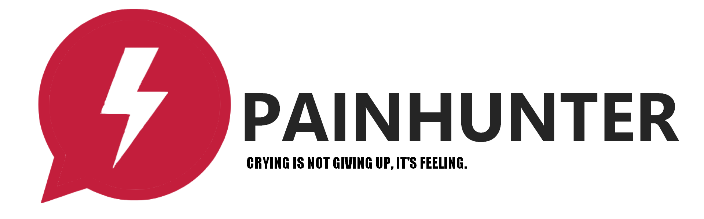

<p align="center">
  
</p>

<h1 align="center">PainHunter</h1>

<p align="center">
  <b>Mr Hunter</b> — tu entrevistador de clima laboral. Una IA que conversa con los empleados sobre su día a día, descubre los obstáculos que los frenan (herramientas, procesos, carga, comunicación) y los recompensa con puntos y trofeos por participar.
</p>

<p align="center">
  
  
  
  
  
  
</p>

---

## Índice

- [Descripción general](#descripción-general)
- [Características](#características)
- [Arquitectura](#arquitectura)
- [Stack tecnológico](#stack-tecnológico)
- [Estructura del proyecto](#estructura-del-proyecto)
- [Primeros pasos](#primeros-pasos)
  - [Requisitos](#requisitos)
  - [1. Clonar el repositorio](#1-clonar-el-repositorio)
  - [2. Configurar el frontend](#2-configurar-el-frontend)
  - [3. Ejecutar el frontend](#3-ejecutar-el-frontend)
  - [4. Compilar para producción](#4-compilar-para-producción)
- [Gamificación](#gamificación)
- [Estructura de la base de datos (Firebase Realtime Database)](#estructura-de-la-base-de-datos-firebase-realtime-database)
- [Roles y superusuarios](#roles-y-superusuarios)
- [Cómo funciona la entrevista con IA](#cómo-funciona-la-entrevista-con-ia)
- [Despliegue](#despliegue)
- [Variables de entorno](#variables-de-entorno)
- [Solución de problemas](#solución-de-problemas)
- [Licencia](#licencia)

---

## Descripción general

**PainHunter** es una plataforma de clima laboral. Un empleado crea su cuenta, tiene una entrevista con **Mr Hunter** y, después de cada conversación, la IA:

1. Detecta obstáculos concretos: procesos lentos, herramientas o licencias faltantes, carga de trabajo, fricciones entre áreas.
2. Extrae **notas de mejora** (internas, visibles solo para el panel de supervisión).
3. Genera una **conclusión** y una **recomendación** accionable para el líder del equipo.

Los empleados ganan **puntos y trofeos** por cada mensaje y cada conversación, manteniéndolos motivados a participar en la entrevista.

Un panel de supervisión permite a los **superusuarios** (Admin, Vigilante, Jefe) inspeccionar usuarios, conversaciones y diagnósticos generados por la IA.

> El chat corre en la nube a través de **OpenRouter** con modelos gratuitos. No se requiere ningún modelo local.

---

## Características

- **Entrevista laboral con Mr Hunter** — un entrevistador empático que hace UNA pregunta abierta a la vez sobre herramientas, procesos, carga de trabajo y comunicación.
- **IA en la nube (OpenRouter)** — modelos gratuitos con fallback automático si el modelo principal no responde.
- **Transcripción por voz** — los audios se transcriben en el navegador con `transformers.js` (Whisper), con servidor local FastAPI como respaldo.
- **Notas de mejora automáticas** — el modelo emite notas estructuradas (`###NOTAS###`), ocultas del chat en streaming y guardadas para el panel.
- **Detección de obstáculos** — flag `es_dolor` por decisión de la IA más coincidencia de palabras clave.
- **Conclusión y recomendación de la IA** — generadas al final de cada conversación para el panel de supervisión.
- **Gamificación** — XP, huellas, niveles, rachas y 12 trofeos por conversación.
- **Autenticación** — Firebase Auth (correo/contraseña) con registro.
- **Base de datos en tiempo real** — usuarios, conversaciones, gamificación y roles de admin en Firebase RTDB.
- **Panel de superusuarios** — roles Admin, Vigilante y Jefe con estadísticas e inspección de conversaciones.
- **Notificaciones con sonido** — las recompensas muestran un toast y reproducen `coins.mp3`.
- **Landing page** — página de marketing con hero, características, pasos, testimonios y FAQ.

---

## Arquitectura

```
┌──────────────────────────┐          ┌───────────────────────────────┐
│  React + Vite (Netlify)  │   HTTP   │  OpenRouter API (nube)        │
│                          │ ──────► │  /api/v1/chat/completions      │
│  - Chat UI (stream SSE)  │   SSE    │  modelos gratuitos + fallback  │
│  - Landing page          │ ◄────── │  - chat streaming              │
│  - Admin panel           │          │  - título                      │
└──────────────────────────┘          │  - conclusión (JSON)           │
        │                             └───────────────────────────────┘
        │ Firebase Auth + Realtime Database
        ▼
┌──────────────────────────┐
│  Firebase (nube)         │   Local (opcional, respaldo):
│  users / conversations / │   Python FastAPI en :8000
│  admins / gamification / │   - /api/transcribe (Whisper)
│  notas                   │
└──────────────────────────┘
```

- El **frontend** habla con **Firebase** para autenticación y persistencia.
- El chat, los títulos y las conclusiones se generan con **OpenRouter** en la nube.
- La transcripción de voz corre primero en el navegador; si no está disponible, cae al servidor local FastAPI.
- Las respuestas en streaming llevan **notas** estructuradas, parseadas en tiempo real y ocultas para el usuario.

---

## Stack tecnológico

| Capa | Tecnología |
|---|---|
| Frontend | React 18, Vite 5, Tailwind CSS 3, React Router 6, iconos Lucide |
| IA (nube) | API de OpenRouter, modelos gratuitos (`google/gemma-4-31b-it:free`) con lista de respaldo |
| IA (local, respaldo) | Python, FastAPI, faster-whisper |
| Voz (navegador) | transformers.js + whisper-tiny |
| Datos y Auth | Firebase Auth, Firebase Realtime Database |
| Despliegue | Build estático Vite → Netlify (solo frontend) |

---

## Estructura del proyecto

```
PainHunter/
├── index.html                # Metadatos + etiquetas sociales/OG
├── package.json
├── tailwind.config.js
├── vite.config.js
├── netlify.toml
├── favicon.ico               # Ícono del proyecto (local, no se sirve)
├── LICENSE                   # MIT
├── .env                      # Variables de entorno (no commiteadas)
├── public/
│   ├── favicon.png
│   ├── sounds/coins.mp3      # Sonido de notificación de recompensa
│   └── img/                  # Logos e imágenes
├── server/                   # Respaldo local de Whisper (opcional)
│   ├── app.py                # Backend FastAPI (transcribe)
│   ├── requirements.txt
│   ├── start-ai.bat
│   └── venv/                 # Entorno virtual local
└── src/
    ├── main.jsx              # Rutas y providers
    ├── firebase.js           # Inicialización de Firebase
    ├── index.css             # Tailwind + animaciones personalizadas
    ├── contexts/             # AuthContext, ToastContext
    ├── hooks/                # useChat, useGamification, usePageTitle, useReveal
    ├── services/             # openRouterService, chatService, adminService,
    │                         # gamificationService, whisperService, chatStorage
    ├── components/           # Chat, Sidebar, GamificationBar, Messages, ...
    ├── pages/                # LandingPage, AuthPage, SuperUserLogin, AdminPanel
    └── App.jsx               # Aplicación principal de chat
```

---

## Primeros pasos

### Requisitos

- **Node.js** 18+ y npm
- Un **proyecto de Firebase** con Auth (correo/contraseña) y Realtime Database habilitados
- Una **clave de OpenRouter** (gratuita) en https://openrouter.ai/keys

### 1. Clonar el repositorio

```bash
git clone <url-del-repositorio>
cd PainHunter
```

### 2. Configurar el frontend

Crea un archivo `.env` en la raíz del proyecto:

```env
VITE_FIREBASE_API_KEY=AIza...
VITE_FIREBASE_AUTH_DOMAIN=tu-proyecto.firebaseapp.com
VITE_FIREBASE_DATABASE_URL=https://tu-proyecto-default-rtdb.firebaseio.com
VITE_FIREBASE_PROJECT_ID=tu-proyecto
VITE_FIREBASE_STORAGE_BUCKET=tu-proyecto.appspot.com
VITE_FIREBASE_MESSAGING_SENDER_ID=...
VITE_FIREBASE_APP_ID=1:...

# OpenRouter — usado para chat, títulos y conclusiones.
VITE_OPENROUTER_API_KEY=sk-or-...
VITE_OPENROUTER_MODEL=google/gemma-4-31b-it:free
```

### 3. Ejecutar el frontend

```bash
npm install
npm run dev
```

Abre `http://localhost:5173` y ya puedes entrevistarte con Mr Hunter.

### 4. Compilar para producción

```bash
npm run build
```

El sitio estático se genera en la carpeta `dist/`.

---

## Gamificación

El progreso se guarda **por conversación** en `gamification/{uid}/{conversationId}`:

| Acción | XP | Huellas |
|---|---|---|
| Enviar un mensaje | 10 | 1 |
| Compartir un obstáculo (palabra clave de dolor) | +15 | +3 |
| Completar una conversación | +25 | — |

- **Niveles** que crecen cada `nivel * 100` XP (nivel 1 = 100 XP, nivel 2 = 200, ...).
- **Trofeos** (12 en total) que se desbloquean por logros: primer mensaje, 10/50 mensajes, primera/5 conversaciones, obstáculos compartidos, niveles, rachas y terminar tu primera entrevista.
- Las notificaciones de recompensa muestran un toast y reproducen `public/sounds/coins.mp3`.

---

## Estructura de la base de datos (Firebase Realtime Database)

```
pain-hunter-default-rtdb (europe-west1)
├── users/
│   └── {uid}/
│       ├── name: string
│       └── gender: string
├── admins/
│   └── {uid}/
│       └── role: "ADMIN" | "VIGILANTE" | "BOSS"
├── conversations/
│   └── {uid}/
│       └── {chatId}/
│           ├── title: string
│           ├── messages: [...]
│           ├── notas: [...]            # notas de mejora (solo panel)
│           ├── conclusion: string
│           ├── es_dolor: boolean
│           ├── recomendacion: string
│           ├── createdAt / updatedAt
└── gamification/
    └── {uid}/
        └── {conversationId}/
            ├── xp, huellas, messages, conversations, painNotes
            ├── trophies: { ... }
            ├── lastActiveDay, streak, bestStreak, conclusionDone
```

**Reglas de seguridad (resumen)**

- Los usuarios comunes solo pueden leer/escribir sus propios nodos `conversations/{uid}` y `gamification/{uid}`.
- Los usuarios con rol en `admins/{uid}` pueden leer `users`, `conversations`, `gamification` y `admins`.

---

## Roles y superusuarios

| Rol | Permisos |
|---|---|
| **ADMIN** | Acceso completo al panel y a todos los datos |
| **VIGILANTE** | Puede monitorear conversaciones |
| **BOSS** | Monitoreo de nivel superior |

Los superusuarios inician sesión por la ruta dedicada `/superusers`. Las páginas públicas (landing, login) **no** exponen el enlace de acceso de superusuarios.

---

## Cómo funciona la entrevista con IA

1. El usuario inicia una entrevista con Mr Hunter.
2. Mr Hunter sigue un método estructurado: **apertura → exploración → profundización (5 porqués) → motivación → cierre**, siempre en español, de 1 a 3 frases, con una sola pregunta a la vez.
3. Cuando el usuario comparte detalles importantes, el modelo agrega `###NOTAS###` seguido de una lista JSON. El parser del stream oculta todo lo que está después del marcador en el chat y guarda las notas para el panel.
4. El endpoint de conclusión analiza los mensajes y devuelve:
   - **conclusion** — un resumen corto de la situación del empleado,
   - **es_dolor** — `true` si describió un obstáculo real (decisión de la IA o coincidencia de palabras clave),
   - **recomendacion** — una recomendación accionable.
5. La IA tiene la instrucción de **nunca** mencionar notas internas, observaciones o registros al empleado — solo habla de la entrevista y de los puntos ganados.

---

## Despliegue

El frontend es un sitio estático de Vite y se despliega a Netlify:

- **Comando de build:** `npm run build`
- **Directorio de publicación:** `dist`

Configura las mismas variables `VITE_*` anteriores como **variables de entorno de Netlify**.

El servidor local de Whisper (`server/`) **no** se despliega; la transcripción en el navegador cubre el reconocimiento de voz en producción.

---

## Variables de entorno

| Variable | Descripción |
|---|---|
| `VITE_FIREBASE_API_KEY` | Clave Web API de Firebase |
| `VITE_FIREBASE_AUTH_DOMAIN` | Dominio de Auth de Firebase |
| `VITE_FIREBASE_DATABASE_URL` | URL de Realtime Database |
| `VITE_FIREBASE_PROJECT_ID` | ID del proyecto de Firebase |
| `VITE_FIREBASE_STORAGE_BUCKET` | Storage bucket |
| `VITE_FIREBASE_MESSAGING_SENDER_ID` | Sender ID |
| `VITE_FIREBASE_APP_ID` | App ID |
| `VITE_OPENROUTER_API_KEY` | Clave de OpenRouter para chat, títulos y conclusiones |
| `VITE_OPENROUTER_MODEL` | Modelo gratuito a usar (con lista de respaldo automática) |

> Todas las credenciales se leen de `.env` (gitignored). **Nunca subas claves reales.**

---

## Solución de problemas

| Problema | Solución |
|---|---|
| `npm.ps1` bloqueado en Windows PowerShell | Usa `npm.cmd run dev` en lugar de `npm run dev` |
| El chat dice que falta la clave de OpenRouter | Agrega `VITE_OPENROUTER_API_KEY` al `.env` y reinicia el servidor de desarrollo |
| El modelo responde lento o con errores | Cambia `VITE_OPENROUTER_MODEL` a otro modelo gratuito; la app hace fallback automático |
| `Permission denied` en escrituras a la BD | Revisa que las reglas de Firebase permitan escribir en el propio nodo `conversations/{uid}` |
| La transcripción por voz falla en el navegador | Inicia el servidor de respaldo: `cd server && python app.py` (Whisper vía FastAPI) |

---

## Licencia

Distribuido bajo la [Licencia MIT](./LICENSE).
